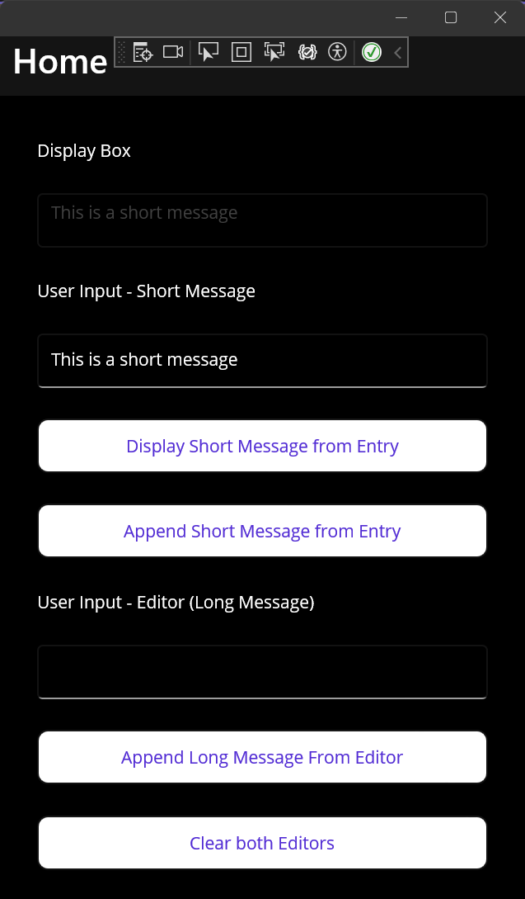

# GA_Prog2_RTB_Access



---
This assignment to get comfortable working with the Editor control. This control is a large textbox for long messages ( like a paragraph or essay )

To add an editor control we use <Editor />.
To reference our editor in our C# we have to give it a name with x:Name.
The .Text attribute is how we set, or get, the Text in the editor.

```xaml
    
    Example
    <Editor 
        Text="This message will be displayed in the editor"
        x:Name="editEditorName"
    />

```

```csharp
    To get the text from the editor
    string userInformation = editEditorName.Text;

    To change the text
    editEditorName.Text = "Message to change to"
```


## Step 1
1. Create a new Maui project
2. Clear template code on MainPage.xaml and MainPage.xaml.cs
3. Add Git, commit, and push your repo online

## Step 2 - Add a Label and an Editor window

1. Add a label.
    1. Change it's Text attribute to "Display Box"
2. Add an Editor `<Editor />`
    2. Set the following attribute
    - x:Name="editDisplay" - This Gives our editor a name of editDisplay
    - IsEnabled="False" <!--- This prevents people from writing in the editor. We are using this editor to just show information.


```xml
   <Label 
        Text="Display Box"   
        />
    <Editor 
        x:Name="editDisplay"
        IsEnabled="False"
        />
```

## Step 2 - Display a short message

In step 2, we are going to let the user type a small message. When the user presses a button, the message will display on our editor labeled  `editDisplay`

**In MainPage.Xaml**
Add a label, an entry ( for a single short message ), and a button.

- Label
    - Text="User Input - Short Message"
- Entry
    - x:Name="entDisplayMessage"
- Button
    - Text="Display Short Message from Entry"
    - x:Name="btnDisplayShortMessage"
    - Add a click event

```xml
      <Label
        Text="User Input - Short Message" 
        />
    <Entry 
        x:Name="entDisplayMessage"       
        />
    <Button
        Text="Display Short Message from Entry"
        x:Name="btnDisplayShortMessage"
        Clicked="btnDisplayShortMessage_Clicked" />
```

**In MainPage.xaml.cs**

Inside of our Button click event, which should be called `btnDisplayShortMessage_Clicked`, we are going to write code so when the user enters text in our entry, named entDisplayMessage, and they press our button, the message shows up in our editor, named editDisplay.

1. First, we will declare a string variable called displayMessage. We will use this to store the data from our entry named, entDisplayMessage. 
 
   `string displayMessage = entDisplayMessage.Text;`

2. Now we will assign the value of displayMessage to our editor, editDisplay.

    `editDisplay.Text = entDisplayMessage.Text;`


```csharp
    private void btnDisplayShortMessage_Clicked(object sender, EventArgs e)
    {
        // Declare a string variable, and how the value from our entry
        string displayMessage = entDisplayMessage.Text;

        // Assign the balue from our varible, to our editor
        editDisplay.Text = displayMessage;
    }
```

--- 

## Step 3 - Append Text from Entry
In the step we will add a new button. When the user clicks the button we will append, add, the text from our entry, entDisplayMessage.


**In MainPage.xaml**

We add 1 button.

- Button
    - Text="Append Short Message from Entry"
    - x:Name="btnAppendShortMessage"
    - Add a click event

```xml
    <Button
        Text="Append Short Message from Entry"
        x:Name="btnAppendShortMessage"
        Clicked="btnAppendShortMessage_Clicked" />

```

**In MainPage.xaml.cs**

In out click event, which should be called, `btnAppendShortMessage_Clicked`, we will write the code so we get the message from our entry, entDisplayMessage, and **Append** it in our rich text box.

The code is similar to our code in our last method.
    - Declare a string variable
    - Store the value from our `entDisplayMessage.Text`

But now instead of assigning the value to our editDisplay, we will append using the `+=` operator.

```csharp
   // The Append short Message event should append the text ( append )
    private void btnAppendShortMessage_Clicked(object sender, EventArgs e)
    {
        string displayMessage = entDisplayMessage.Text;
        editDisplay.Text += displayMessage;
    }
```

---
## Step 4 - Append From another Editor
Here, we will add another label, a 2nd editor, and another button. When the user presses this button, the text from our editor will append to our editDisplay.


**In MainPage.xaml**

    - Label
        - Text="User Input - Editor (Long Message)"
    - Editor
        - x:Name="editUserLongMessage"
    - Button
        - Text="Append Long Message From Editor"
        - x:Name="btnAppendLongMessage"
        - Add a click event

```xml
    <Label 
        Text="User Input - Editor (Long Message)"
        />
    <Editor 
        x:Name="editUserLongMessage"
                
        />
    <Button
        Text="Append Long Message From Editor"
        x:Name="btnAppendLongMessage"
        Clicked="btnAppendLongMessage_Clicked" />

```

**In MainPage.xaml.cs**

Inside of our new click event, which should be named `btnAppendLongMessage_Clicked`, we will write code to 
    - Declare a new string variable, name longMessageToAppend
    - Assign the value from our new editor with editUserLongMessage.Text
    - APPEND that value to our original editor, editDisplay

```csharp

    // This will append the message from our editor ( for long messages )
    private void btnAppendLongMessage_Clicked(object sender, EventArgs e)
    {
        string longMessageToAppend = editUserLongMessage.Text;

        editDisplay.Text += longMessageToAppend;
    }
```

---
## Step 5 - Clear all text entrys and editors

Finally, we create a button that when pressed, clears all the text from our
    - Entry: entDisplayMessage
    - Editor: editDisplay
    - Editor: editUserLongMessage

**In MainPage.xaml**
Add a button

        - Text="Clear both Editors"
        - x:Name="btnClear"
        - Add a click event

```xml
    <Button
        Text="Clear both Editors"
        x:Name="btnClear"
        Clicked="btnClear_Clicked" />
```

**In MainPage.xaml.cs**

Inside our method, all we need to do to clear a .Text field is to assign an empty set of double quotes, `""`.

So assign empty double quotes to our entDisplayMessage, editDisplay, and editUserLongMessage.

```csharp

    // Clear - Clears all text inputs. Both Editors and the Entry
    private void btnClear_Clicked(object sender, EventArgs e)
    {
        entDisplayMessage.Text = "";
        editDisplay.Text = "";
        editUserLongMessage.Text = "";
    }
```

---

With this you should have an app that lets the user display and append short and long messages to a editor. You can then clear all text boxes with a button click.

---

## For Submission
Submit your GitHub repository link

---
## The Full Code


```xml
    <!-- Editor, Label, Button, Entry -->
    <Label 
        Text="Display Box"   
        />
    <Editor 
        x:Name="editDisplay"
        IsEnabled="False"
        />
    <Label
        Text="User Input - Short Message" 
        />
    <Entry 
        x:Name="entDisplayMessage"       
        />
    <Button
        Text="Display Short Message from Entry"
        x:Name="btnDisplayShortMessage"
        Clicked="btnDisplayShortMessage_Clicked" />
    <Button
        Text="Append Short Message from Entry"
        x:Name="btnAppendShortMessage"
        Clicked="btnAppendShortMessage_Clicked" />

    <Label 
        Text="User Input - Editor (Long Message)"
        />
    <Editor 
        x:Name="editUserLongMessage"
                
        />
    <Button
        Text="Append Long Message From Editor"
        x:Name="btnAppendLongMessage"
        Clicked="btnAppendLongMessage_Clicked" />
    <Button
        Text="Clear both Editors"
        x:Name="btnClear"
        Clicked="btnClear_Clicked" />

```

```csharp
    // This display short message click event should replace the text in the editor
    private void btnDisplayShortMessage_Clicked(object sender, EventArgs e)
    {
        string displayMessage = entDisplayMessage.Text;

        editDisplay.Text = displayMessage;
    }

    // The Append short Message event should append the text ( append )
    private void btnAppendShortMessage_Clicked(object sender, EventArgs e)
    {
        string displayMessage = entDisplayMessage.Text;

        editDisplay.Text += displayMessage;
    }

    // This will append the message from our editor ( for long messages )
    private void btnAppendLongMessage_Clicked(object sender, EventArgs e)
    {
        string longMessageToAppend = editUserLongMessage.Text;

        editDisplay.Text += longMessageToAppend;
    }

    // Clear - Clears all text inputs. Both Editors and the Entry
    private void btnClear_Clicked(object sender, EventArgs e)
    {
        entDisplayMessage.Text = "";
        editDisplay.Text = "";
        editUserLongMessage.Text = "";
    }

```

--- 

### 1. Label - "Display Box"
Control Type: Label

Purpose: Displays static text as a heading for an Editor control.

### 2. Editor - editDisplay
Control Type: Editor

Attributes:
`x:Name="editDisplay"` - Identifier for referencing in code.

`IsEnabled="False"` - Not editable, for display only.
### 3. Label - "User Input - Short Message"

Control Type: Label

Purpose: Serves as an instruction or heading for the Entry field.

### 4. Entry - entDisplayMessage

Control Type: Entry

Attributes:
`x:Name="entDisplayMessage"` - Identifier for input field.

### 5. Button - "Display Short Message from Entry"

Control Type: Button

Attributes:

Text="Display Short Message from Entry" - Display text.

`x:Name="btnDisplayShortMessage"` - Button identifier.

Clicked="btnDisplayShortMessage_Clicked" - Event handler for click.

Behavior: Displays text from entDisplayMessage in editDisplay upon click.

### 6. Button - "Append Short Message from Entry"

Attributes: Similar to the previous button but for appending text.

### 7. Label - "User Input - Editor (Long Message)"

Control Type: Label

### 8. Editor - editUserLongMessage

Control Type: Editor

Attributes:

`x:Name="editUserLongMessage"` - Identifier for the editor.

### 9. Button - "Append Long Message From Editor"

Behavior: Appends text from editUserLongMessage to editDisplay.

### 10. Button - "Clear both Editors"

Behavior: Clears text from both editDisplay and editUserLongMessage.

**Summary**

The layout includes text input fields (Entry and Editor) and Buttons for actions based on the input.

Labels provide user guidance.

Functionality like appending text or clearing fields is defined in the event handlers in the code-behind file.
